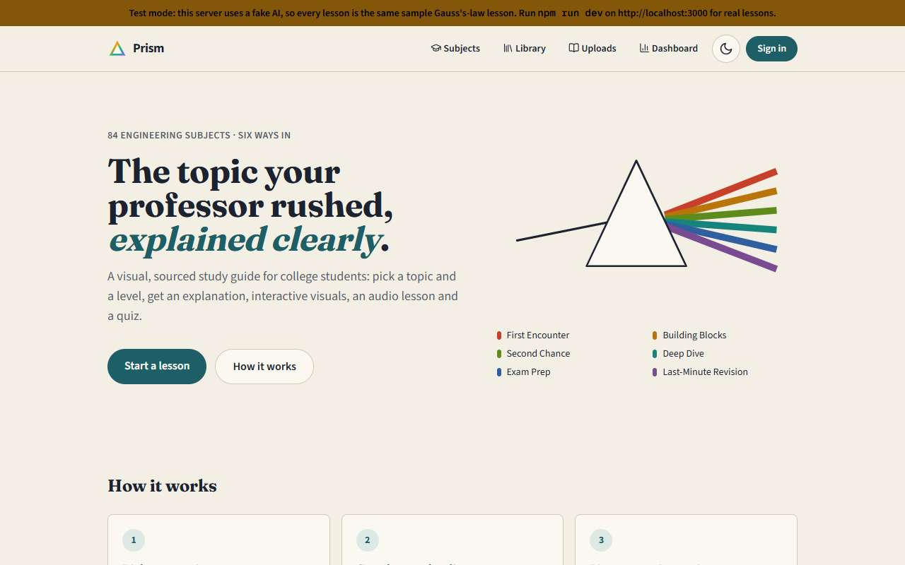
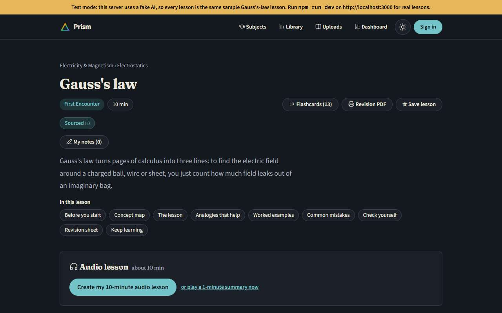
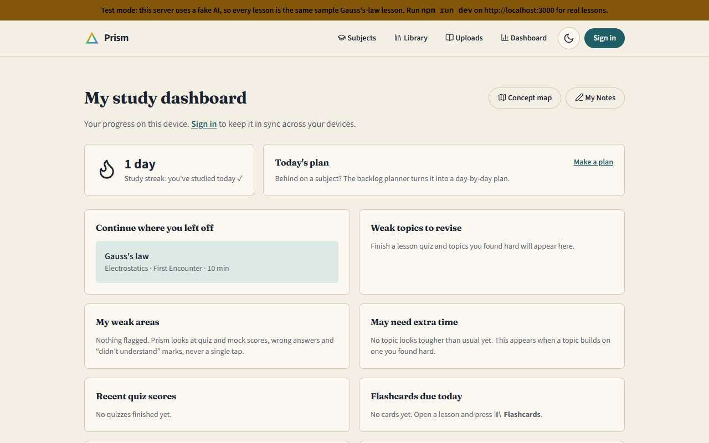
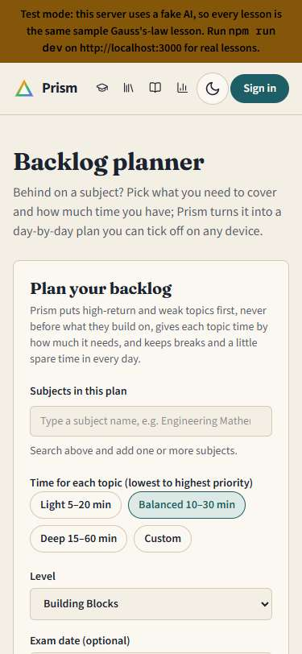

# Prism

A visual, sourced study guide for engineering students. Pick a subject, chapter and topic, say how well you know it and how much time you have, and get a lesson with interactive visuals, worked examples, a quiz, a revision sheet, an audio narration and a source for every claim. The same checked lesson can instead become a PowerPoint deck or a PDF.



## What it does

- **Lessons at six levels**, from First Encounter to Last-Minute Revision, at any length from 5 to 90 minutes. Each level owns one colour of the spectrum, used everywhere that level appears.
- **84 engineering subjects** across the common B.Tech / B.E. branches, with syllabus data, golden sets of key facts and a trust tier (`verified`, `tested`, `sourced`, `limited`) shown honestly on every subject. See [the accuracy page](/accuracy) in the app and `EVAL_LOG.md`.
- **Accuracy by design:** grounding in fetched sources, a separate fact-check pass, numerical answers re-computed in code, code samples run before they are shown, every formula typeset or rejected, and AI output validated with Zod before anything is drawn.
- **Visuals the AI cannot invent:** it only chooses from hand-coded, unit-tested widgets, PhET simulations, validated Mermaid diagrams, plots and Wikimedia images (with licence and credit). Gallery at `/dev/visuals`.
- **Whole chapters, your own notes and subjects:** upload PDFs, images, slides or text; build a lesson for a whole chapter; add subjects Prism doesn't list.
- **Personal study tools:** audio lessons, highlights and comments, flashcards, mock tests, a priority engine (topic importance, weak and tough topics, recommended lesson length) and a multi-subject planner with sessions, breaks and an 8-hour day cap.
- **Bring your own API key** (Gemini, Groq, OpenAI, Anthropic, xAI, OpenRouter): kept only on your device, used for one request at a time, never stored or logged by the server.
- **Slides and PDFs:** four designed themes, editable `.pptx` with speaker notes, PDFs with selectable text, a contents page and page numbers. Interactive visuals become labelled still images.
- **Accounts and sync** (Firebase free plan): progress follows you across devices; guests keep everything on the device.

## Feature flags

Every new feature can be switched off without touching code: set `NEXT_PUBLIC_FLAG_BYO_KEY`, `NEXT_PUBLIC_FLAG_SLIDES_PDF`, `NEXT_PUBLIC_FLAG_REDESIGN` or `NEXT_PUBLIC_FLAG_COMMUNITY` to `0` or `1` and redeploy. See `src/lib/flags.ts` and `DEPLOY_CHECKLIST.md`. With the redesign flag off, everyone sees the earlier "Classic" look; with it on, the footer has a "Classic look" switch.

## Screens

| Lesson (dark)                                             | Dashboard                                                  | Phone                                                |
| --------------------------------------------------------- | ---------------------------------------------------------- | ---------------------------------------------------- |
|  |  |  |

## Run it on your computer

Requires Node.js 20.9 or newer.

```bash
npm install
cp .env.example .env.local   # then paste your Gemini key into .env.local
npm run dev                  # http://localhost:3000
```

Get a free Gemini key at https://aistudio.google.com/apikey and set `GEMINI_API_KEY=` in `.env.local`. Without a key the app still runs: the Gauss's law First Encounter lesson is built in, and other topics show a friendly "AI isn't switched on yet" message. For offline testing, `LLM_PROVIDER=fake` streams a canned lesson.

## Put it online (Vercel, free)

1. Sign in at https://vercel.com with your GitHub account.
2. **Add New → Project**, choose the `Prism` repository, and click **Import**.
3. Open **Environment Variables** and add `GEMINI_API_KEY` with your key (optionally `GROQ_API_KEY` too). Do **not** add `LLM_PROVIDER`.
4. Click **Deploy**. After about a minute you get a live URL like `https://prism-xxxx.vercel.app`.
5. Every `git push` to `main` redeploys automatically.

## Scripts

| Command          | What it does                                                                                                                                       |
| ---------------- | -------------------------------------------------------------------------------------------------------------------------------------------------- |
| `npm run dev`    | Development server                                                                                                                                 |
| `npm run check`  | Typecheck, lint, format check and all tests                                                                                                        |
| `npm run build`  | Production build                                                                                                                                   |
| `npm run eval`   | Accuracy eval: writes a lesson for each of the 15 golden-set topics and reports the % of key facts stated (needs a key; `-- --fake` for a dry run) |
| `npm run format` | Auto-format the code                                                                                                                               |

## Credits

Simulations: [PhET Interactive Simulations](https://phet.colorado.edu), University of Colorado Boulder, CC BY 4.0. Textbook sections: [OpenStax University Physics Volume 2](https://openstax.org/details/books/university-physics-volume-2), CC BY 4.0. Encyclopedia text and images: Wikipedia and Wikimedia Commons contributors, licences shown beside each image.
